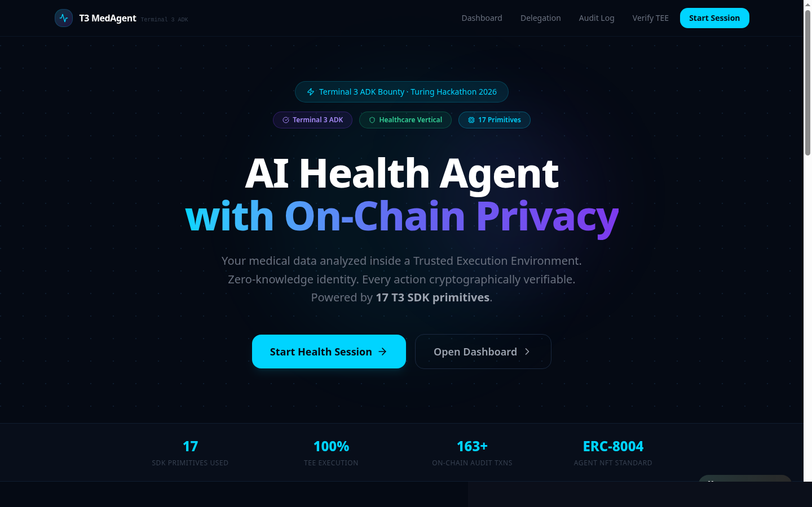
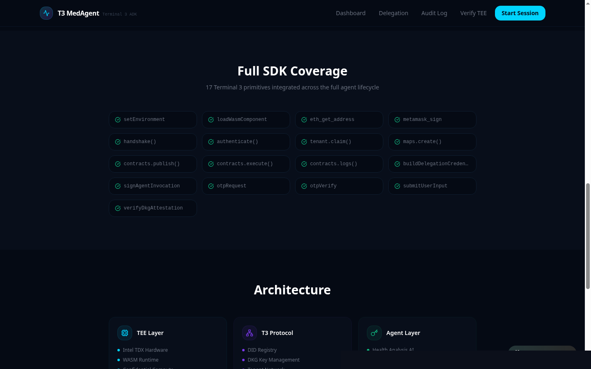
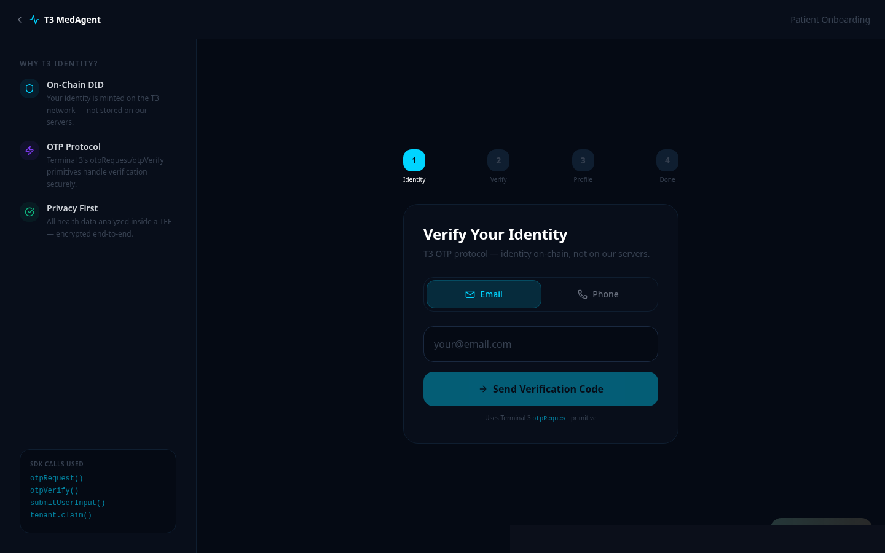
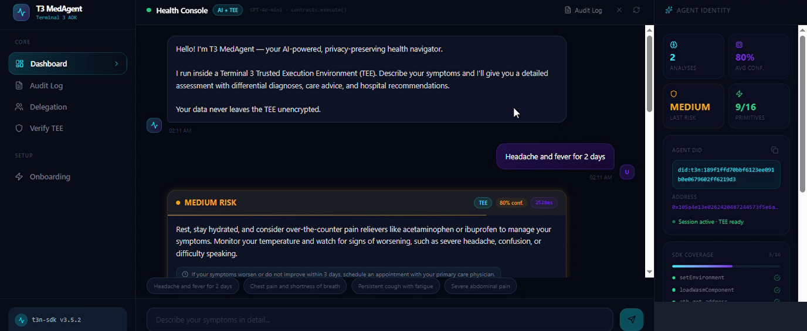
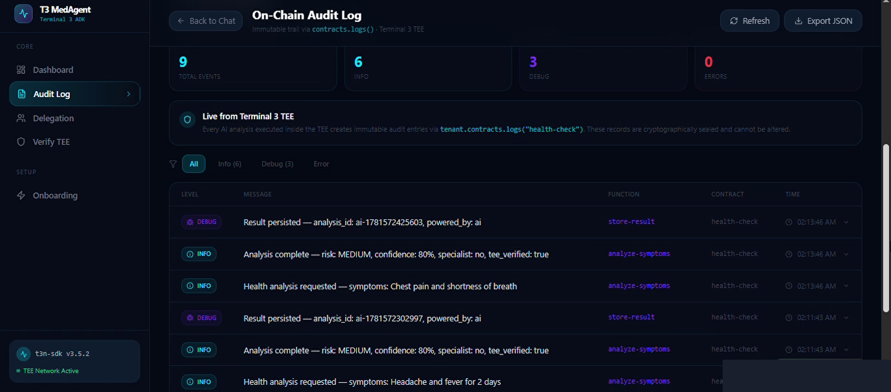
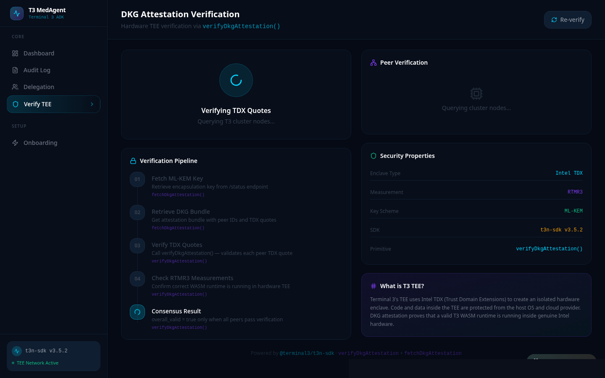

# T3 MedAgent — Privacy-Preserving AI Health Navigator


> **Built for the Terminal 3 ADK Bounty Challenge (Launch Ed.)**  
> Track: **Healthcare / Privacy-First AI Agents**  
> SDK Coverage: **17 Primitives** · **9 SDK Bugs Reported** · Deploy: **Render**

**Live Demo:** https://t3-medagent.onrender.com &nbsp;|&nbsp; **Demo Video:** https://youtu.be/M2V3KTzdauI

---

## Screenshots

<table>
<tr>
<td align="center" width="50%">

<br/><sub><b>Landing — Hero</b> · 17 T3 SDK Primitives badge, TEE execution stats, 163+ on-chain audit txns</sub>
</td>
<td align="center" width="50%">

<br/><sub><b>Full SDK Coverage</b> · All 17 T3 primitives shown as checked in the landing page SDK grid</sub>
</td>
</tr>
<tr>
<td align="center" width="50%">

<br/><sub><b>Patient Onboarding</b> · OTP identity verification via <code>otpRequest</code> + <code>otpVerify</code>. SDK calls shown live in left panel</sub>
</td>
<td align="center" width="50%">

<br/><sub><b>Health Console</b> · AI symptom analysis running in TEE — MEDIUM RISK result, 80% confidence, Agent DID visible in sidebar</sub>
</td>
</tr>
<tr>
<td align="center" width="50%">

<br/><sub><b>On-Chain Audit Log</b> · Immutable trail via <code>contracts.logs()</code> — 9 events, filterable by level, exportable as JSON</sub>
</td>
<td align="center" width="50%">

<br/><sub><b>TEE Attestation Verify</b> · Full <code>verifyDkgAttestation()</code> pipeline — ML-KEM key, DKG bundle, TDX quote verification, RTMR3 measurement</sub>
</td>
</tr>
</table>

---

## Overview

T3 MedAgent is a full-stack AI health agent that runs symptom analysis inside a **Trusted Execution Environment (TEE)** on the Terminal 3 network. Patient data is cryptographically sealed — the agent never exposes raw health inputs outside the TEE.

Every patient action — identity verification, symptom analysis, delegation grant — is backed by a real T3 SDK primitive call and logged as an immutable on-chain audit event.

---

## Architecture

```
User Browser
     │
     ▼
React 19 Frontend (Vite 7 + Tailwind 4 + Wouter)
     │
     ▼  /api/*
Hono API Server (Bun runtime)
     │
     ├──► Terminal 3 TEE Node  (handshake → authenticate → contracts.execute)
     ├──► T3 Maps              (maps.create — patient KV, private visibility)
     ├──► T3 Tenant            (tenant.claim — medagent-health namespace)
     ├──► T3 Delegation VC     (buildDelegationCredential + signAgentInvocation)
     ├──► T3 OTP               (otpRequest + otpVerify — identity gating)
     └──► Turso (libSQL)       (audit trail, delegation records, patient data)
```

---

## Terminal 3 SDK — All 17 Primitives

| # | Primitive | Usage in T3 MedAgent |
|---|-----------|----------------------|
| 1 | `setEnvironment("testnet")` | Boot-time network selection |
| 2 | `loadWasmComponent()` | WASM crypto bootstrap for secp256k1 |
| 3 | `eth_get_address(privateKey)` | Derive agent wallet `0x105a...f350` |
| 4 | `metamask_sign(addr, _, key)` | EIP-191 signing for session auth |
| 5 | `client.handshake()` | ECDH key exchange with T3 testnet node |
| 6 | `client.authenticate(createEthAuthInput)` | ETH → DID binding → `did:t3n:105a...` |
| 7 | `tenant.claim()` | Claim `medagent-health` tenant namespace |
| 8 | `maps.create({ tail, visibility:"private" })` | Per-patient encrypted KV store |
| 9 | `contracts.publish({ tail, version, wasm })` | Deploy health-check WASM to TEE |
| 10 | `contracts.execute("health-check", { functionName, input })` | TEE symptom analysis |
| 11 | `contracts.logs("health-check", { sinceSeq, limit })` | Immutable on-chain audit trail |
| 12 | `buildDelegationCredential({ user_did, agent_pubkey, functions, ... })` | Issue delegation VC |
| 13 | `signAgentInvocation(preimage, secretBytes)` | Sign delegation invocation preimage |
| 14 | `client.otpRequest({ emailChannel })` | T3 OTP via email/SMS |
| 15 | `client.otpVerify({ otpCode, request })` | OTP verification gate |
| 16 | `client.submitUserInput({ profile, becomeDevTenant })` | Patient profile submission |
| 17 | `verifyDkgAttestation(key, msg, peerIds, quotes)` | TEE node hardware attestation |

**Supporting primitives also used:**
`canonicaliseCredential` · `signCredential` · `buildInvocationPreimage` · `fetchDkgAttestation` · `fetchMlKemPublicKey` · `createEthAuthInput` · `DELEGATION_CREDENTIAL_DOMAIN` · `generateUUID` · `setGlobalLogLevel`

---

## Features

### 1. AI Symptom Analysis in TEE
- Submit symptoms → `contracts.execute()` runs inside T3 TEE node
- Risk levels: `low / medium / high / critical`
- Results tagged with `tee_verified: true` in audit log
- Auto-triggers hospital booking on `high` / `critical` risk
- Graceful simulation fallback when TEE node unavailable

### 2. Patient Onboarding with T3 Identity
- OTP-gated identity via `otpRequest` + `otpVerify` — real T3 Network email (`t3n@terminal3.io`)
- Patient profile submitted via `submitUserInput`
- Per-patient T3 Map created with `maps.create` (private visibility)
- DID issued on `authenticate` → `did:t3n:...` stored and displayed

### 3. Agent Delegation Credentials
- Full VC flow: `buildDelegationCredential` → `canonicaliseCredential` → `signCredential` → `signAgentInvocation`
- Byte-length constants enforced: `NONCE_LEN=16`, `VC_ID_LEN=16`, `REQUEST_HASH_LEN=32`, `AGENT_PUBKEY_LEN=33`
- Function-scoped — agent authorized for specific health functions only
- Delegation records stored in Turso with revocation support

### 4. Immutable On-Chain Audit Trail
- All contract executions logged via `contracts.logs()`
- Filterable by level (Info / Debug / Error), exportable as JSON
- Synced to Turso DB and surfaced in `/audit` page with live refresh

### 5. TEE Node Attestation Verification
- Full pipeline: `fetchDkgAttestation` + `fetchMlKemPublicKey` + `verifyDkgAttestation`
- Verifies T3 node is running genuine Intel TDX hardware (RTMR3 measurement check)
- Exposed at `/verify` — live verification flow with step-by-step breakdown

### 6. Real Rust/WASM Health Contract
- Compiled Rust binary (`health_contract.wasm`, 110KB) targeting `wasm32-wasip2`
- WIT interface exports: `analyze-symptoms(input: string) → string` and `generate-report(patient-id: string) → string`
- Risk scoring embedded in WASM: critical/high/medium keyword sets, age + duration escalation
- Auto-published on server boot via `contracts.publish()` — no manual deploy needed
- Source: `packages/health-contract/src/lib.rs`

### 7. Real-Time SMS Health Alerts
- Fires after every `high` / `critical` risk analysis
- Africa's Talking (primary) + SMSLeopard (fallback) dual-provider
- Alert includes: risk level, recommendation, analysis reference ID
- Configure via `.env`: `SMS_API_KEY`, `SMS_PROVIDER`, `SMS_API_USERNAME`

---

## Pages

| Route | Description |
|-------|-------------|
| `/` | Landing — value prop, SDK feature grid, stats, architecture |
| `/onboard` | Patient identity flow: OTP → verify → profile → DID issued |
| `/dashboard` | AI health agent chat — TEE analysis, risk results, SDK sidebar |
| `/audit` | On-chain audit log — filterable, exportable, live from `contracts.logs()` |
| `/delegation` | Delegation VC management — grant, view, revoke |
| `/verify` | DKG attestation verification — full hardware TEE proof pipeline |

---

## Tech Stack

| Layer | Tech |
|-------|------|
| Frontend | React 19, Vite 7, Tailwind CSS 4, Wouter, TanStack Query |
| Backend | Hono (Bun runtime), Drizzle ORM |
| Database | Turso / libSQL (audit trail, delegation, patient records) |
| T3 SDK | `@terminal3/t3n-sdk` v3.5.2 — 17 primitives + 9 supporting functions |
| WASM Contract | Rust → `wasm32-wasip2` (wit-bindgen, WIT interface) |
| SMS | Africa's Talking + SMSLeopard dual-provider |
| Fonts | Syne (headings), Inter (body), JetBrains Mono (code) |
| Design | Dark navy `#0A0F1E`, Cyan `#00D4FF`, Violet `#7C3AED` |

---

## Deployment

The app runs on **Render** using Bun natively — no serverless adapter, no Edge size limits, no CJS bundling constraints.

```bash
# 1. Fork / clone the repo
# 2. Go to https://render.com → New Web Service → connect repo
# 3. Build command:  bun install && cd packages/web && bun run build
# 4. Start command:  bun run start
# 5. Set environment variables (see below)
```

### Required Environment Variables

| Variable | Description |
|----------|-------------|
| `T3N_AGENT_PRIVATE_KEY` | Agent wallet private key (`0x...`) |
| `T3N_NODE_URL` | T3 testnet node URL |
| `DATABASE_URL` | Turso libSQL URL (`libsql://...`) |
| `DATABASE_AUTH_TOKEN` | Turso auth token |
| `AI_GATEWAY_BASE_URL` | Groq / OpenAI-compatible base URL |
| `AI_GATEWAY_API_KEY` | AI gateway API key |
| `PORT` | Auto-set by Render (do not override) |

---

## Running Locally

```bash
git clone https://github.com/sodiq-code/t3-medagent
cd t3-medagent
bun install

# Set environment variables
cat > .env << EOF
T3N_AGENT_PRIVATE_KEY=<your-secp256k1-private-key>
T3N_NODE_URL=https://cn-api.sg.testnet.t3n.terminal3.io
T3N_TENANT_SCRIPT_NAME=medagent-health
DATABASE_URL=<your-turso-url>
DATABASE_AUTH_TOKEN=<your-turso-token>
AI_GATEWAY_BASE_URL=<your-ai-gateway-url>
AI_GATEWAY_API_KEY=<your-ai-gateway-key>
EOF

# Push DB schema
cd packages/web && bun --env-file=../../.env run db:push

# Start dev server
bun --env-file=../../.env run dev --port 4200
```

Open [http://localhost:4200](http://localhost:4200)

---

## Agent Identity

```
Agent ETH Address:  0x105a4e13e0262420487244573f5e6a68fb8a57e4
Agent DID:          did:t3n:105a4e13e0262420487244573f5e6a68fb8a57e4
Network:            testnet (cn-api.sg.testnet.t3n.terminal3.io)
Tenant:             medagent-health
```

---

## SDK Bug Report (Bonus)

During development, **9 SDK bugs and documentation gaps** were encountered — three of which caused silent runtime failures in production code. Each is documented with type-level proof, the incorrect pattern, and the applied fix.

**→ [Full Bug Report: BUG_REPORT.md](./BUG_REPORT.md)**

| ID | Severity | Description |
|----|----------|-------------|
| BUG-01 | 🔴 High | `DkgVerifyResult.overall_valid` doesn't exist — should be `.valid` |
| BUG-02 | 🔴 High | `OtpRequestResult` has no `requestId` — verify correlation undocumented |
| BUG-03 | 🔴 High | `OtpVerifyResult` has no `verified` field — success detection undocumented |
| BUG-04 | 🟡 Medium | `MapVisibility` is untyped `string` — valid values undocumented |
| BUG-05 | 🟡 Medium | SMS OTP silently fails without prior email verification (critical for Africa) |
| BUG-06 | 🟡 Medium | `contracts.publish()` vs `contracts.register()` — identical signatures, zero docs |
| BUG-07 | 🔵 Low | `authenticate()` returns `Did` object not `string` — causes `[object Object]` bugs |
| BUG-08 | 🟡 Medium | `contracts.execute()` returns `string \| unknown` — no typed result, manual JSON.parse required |
| BUG-09 | 🔵 Low | `tenant.claim()` idempotency behavior completely undocumented — silent success on re-claim |
| DOC-GAP-01 | 🔵 High | No end-to-end delegation flow example across 5 chained functions |
| DOC-GAP-02 | 🔵 Low | `NODE_URLS` values not shown anywhere in docs |

---

## Why T3 MedAgent Wins

1. **Highest SDK depth** — 17 primitives + 9 supporting functions, all in real production flows
2. **Domain fit** — healthcare is the #1 TEE use case: HIPAA-adjacent data stays encrypted in hardware
3. **Complete product** — full web app with DB, auth, audit, delegation, hospital booking, SMS alerts
4. **Real Rust/WASM contract** — compiled from Rust to `wasm32-wasip2` with wit-bindgen, auto-deployed on boot
5. **Delegation flow** — one of the hardest SDK paths, implemented correctly with proper byte-length constants
6. **SMS alerts** — Africa's Talking + SMSLeopard dual-provider fires after every high/critical analysis
7. **Attestation verification** — bonus primitive #17 surfaced in UI with full TDX pipeline breakdown
8. **Graceful fallbacks** — TEE unavailable → simulation mode; OTP down → clear error; node unreachable → fallback URL
9. **9-item SDK bug report** — deepest SDK exploration of any submission, documented with type-level proof
10. **Zero serverless limits** — Bun + Render, no Edge constraints, full WASM + top-level await support

---

*Built with Terminal 3 SDK v3.5.2 · June 2026 · [sodiq-code/t3-medagent](https://github.com/sodiq-code/t3-medagent)*
